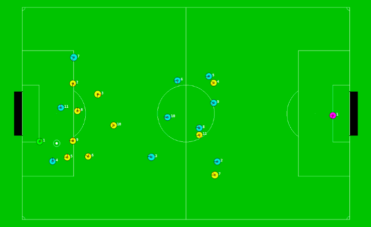

# wrighteaglebase
This is the code release of WrightEagleBASE, which serves as the basic framework of [WrightEagle](http://aijunbai.github.io/wrighteagle2d/).

# Highlights

- WrightEagle has won 6 _world champions_ and 5 runners-up in annual RoboCup Soccer Simulation 2D competitions since 2005. Detailed historical results from 2005 to 2013 can be found as follows:

- WrightEagle/WrightEagleBASE is developed following the [MAXQ-OP](https://github.com/aijunbai/maxq-op) online planning algorithm for [Markov Decision Processes](https://en.wikipedia.org/wiki/Markov_decision_process). The [MAXQ-OP](https://github.com/aijunbai/maxq-op) task structure of the agent:  

# Binaries
For latest WrightEagle binaries used in [RoboCup Soccer Simulation 2D](https://en.wikipedia.org/wiki/RoboCup_2D_Soccer_Simulation_League) competitions, please refer to: [http://aijunbai.github.io/wrighteagle2d/](http://aijunbai.github.io/wrighteagle2d/)

# References
Researchers are encouraged to cite the following selected papers when using WrightEagleBASE/WrightEagle codes/binaries/materials in research:

- [Online planning for large Markov decision processes with hierarchical decomposition](http://aijunbai.github.io/publications/BWCtist15.pdf), Aijun Bai, Feng Wu, and Xiaoping Chen, ACM Transactions on Intelligent Systems and Technology (ACM TIST),6(4):45:1–45:28, July 2015.
- [Online Planning for Large MDPs with MAXQ Decomposition (Extended Abstract)](http://aijunbai.github.io/publications/AAMAS12-Bai.pdf), Aijun Bai, Feng Wu,    and Xiaoping Chen, Proceedings of the 11th International Conference on Autonomous Agents and Multiagent Systems (AAMAS), Valencia, Spain, June 2012.
- [Towards a Principled Solution to Simulated Robot Soccer](http://aijunbai.github.io/publications/LNAI12-Bai.pdf), Aijun Bai, Feng Wu, and Xiaoping Chen,     RoboCup-2012: Robot Soccer World Cup XVI, Lecture Notes in Artificial Intelligence, Vol. 7500, Springer Verlag, Berlin, 2013.
- [WrightEagle and UT Austin Villa: RoboCup 2011 Simulation League Champions](http://aijunbai.github.io/publications/LNAI11-Bai.pdf), Aijun Bai, Xiaoping      Chen, Patrick MacAlpine, Daniel Urieli, Samuel Barrett, and Peter Stone, RoboCup-2011: Robot Soccer World Cup XV, Lecture Notes in Artificial Intelligence,    Vol. 7416, Springer Verlag, Berlin, 2012.
- [Bounded Incremental Real-Time Dynamic Programming](http://ieeexplore.ieee.org/xpl/login.jsp?tp=&arnumber=4524180&url=http%3A%2F%2Fieeexplore.ieee.org%2Fxpls%2Fabs_all.jsp%3Farnumber%3D4524180), Changjie Fan, and Xiaoping Chen, IEEE Proceedings of FBIT 2007, Jeju Island, Korea, 2007.
- [Solving Large-Scale and Sparse-Reward DEC-POMDPs with Correlation-MDPs](http://link.springer.com/chapter/10.1007%2F978-3-540-68847-1_18), Feng Wu, and Xiaoping Chen, Proceedings of RoboCup Symposium 2007. Atlanta, America, July 2007.

All publications of the WrightEagle team (WrightEagle 2D, WrightEagle@Home, WrightEagle SPL and WrightEagle 3D) can be found at: [http://www.wrighteagle.org/en/publication/index.php](http://www.wrighteagle.org/en/publication/index.php)

# Videos:
- [Final of RoboCup 2015](https://www.youtube.com/watch?v=Ptzv9NF9opM) (HELIOS2015\_0-vs-WrightEagle\_3)
- [Final of RoboCup 2014](https://www.youtube.com/watch?v=kRIygFjlD_Q) (WrightEagle\_3-vs-Gliders2014\_2)
- [Final of RoboCup 2013](https://www.youtube.com/watch?v=BoWoIc4IrtI) (WrightEagle\_2-vs-HELIOS2013\_0)
- [Final of RoboCup 2012](https://www.youtube.com/watch?v=cDhSjSYPvdE) (HELIOS2012\_4-vs-WrightEagle\_1)
- [Final of RoboCup 2011](https://www.youtube.com/watch?v=leNDA5tzUfk) (WrightEagle\_3-vs-HELIOS2011\_2)
- [Final of RoboCup 2010](https://www.youtube.com/watch?v=BVWkndHk3AE) (HELIOS2010\_2-vs-WrightEagle\_1)
- [Final of RoboCup 2009](https://www.youtube.com/watch?v=Q18Wxs3Da-8&index=7&list=PL4BB027D8BB6A5EB3) (HELIOS2009\_1-vs-WrightEagle\_2)
- [Final of RoboCup 2008](https://www.youtube.com/watch?v=w1c_8TWX8dY) (Brainstormers08\_0\_4-vs-WE2008\_0\_3)

# Compilation
- `$make [debug]` for a debug version with debugging information and assertions.
- `$make release` for a release version

# Usages
A [RoboCup Soccer 2D Simulator](https://sourceforge.net/projects/sserver/files/) (as well as a monitor and a logplayer) is needed to run WrightEagleBASE. Please refer to [https://wavepackage.wordpress.com/2013/06/07/how-to-install-the-robocup-soccer-server-2d/](https://wavepackage.wordpress.com/2013/06/07/how-to-install-the-robocup-soccer-server-2d/) and [https://wavepackage.wordpress.com/2015/07/22/how-to-install-robocup-2d-simulation-server-on-ubuntu-14-04/](https://wavepackage.wordpress.com/2015/07/22/how-to-install-robocup-2d-simulation-server-on-ubuntu-14-04/) for installation instructions.  

After installation,  

- Run `$rcssserver` to start a soccer server which simulates the game
- Run `$rcssmonitor` to start a soccer monitor which is used to display the game
- Run `$./start.sh` to start a team on the left side with default teamname *WEBase*
- Run `$./start.sh -t [TEAMNAME]` to start a team on the right side with teamname *[TEAMNAME]*

After both teams connected, send a `KickOff` command to the server by hitting `Ctrl+K` in the monitor to start the game!

# Hacks
- `void Player::Run` in `src/Player.cpp` is the main loop consisting of sensing, decision-making and executing
- `ActiveBehavior DecisionTree::Search` in `src/DecisionTree.cpp` is the main decision-making loop
- `void Behavior*::Plan` in `src/Behavior*.cpp` implement planning part of behaviours
- `void Behavior*::Execute` in `src/Behavior*.cpp` implement executing part of behaviours

A good start to hack the team is digging into `void Behavior*::Plan` functions.

# Screenshot
A game screenshot between *WEBase* and *TestTeam*:  

